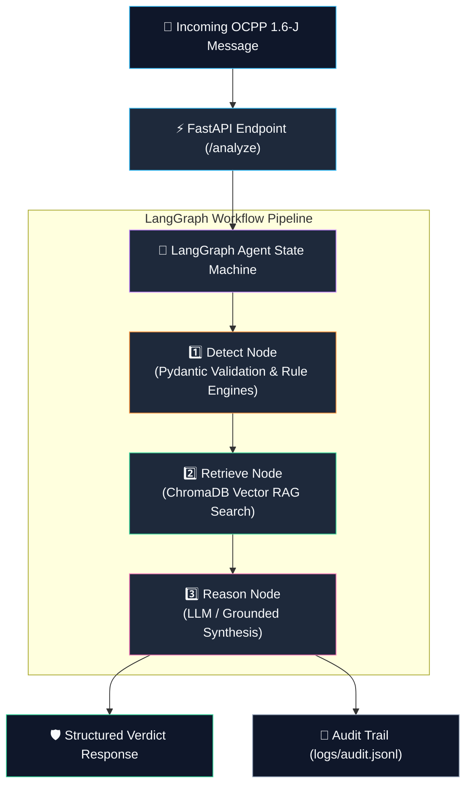

<div align="center">

# 🛡️ OCPP Sentinel

### *AI Security Triage Copilot for EV Charging Stations*

[](https://www.python.org/)
[](https://fastapi.tiangolo.com/)
[](https://www.langchain.com/langgraph)
[](https://www.trychroma.com/)
[](https://www.docker.com/)
[](#-testing)

<p align="center">
  <b>An AI-powered cybersecurity copilot that analyzes Open Charge Point Protocol (OCPP 1.6-J) messages in real-time, detects STRIDE attack patterns, and provides RAG-grounded verdicts with exact protocol spec citations.</b>
</p>

[Key Features](#-key-features) •
[Architecture](#-system-architecture) •
[Attack Scenarios](#-the-5-stride-attack-scenarios) •
[Quickstart](#-quickstart-guide) •
[API Docs](#-api-reference) •
[Demo UI](#-interactive-demo-web-ui)

---

</div>

## 📌 Executive Summary

Modern Electric Vehicle (EV) Charging Station Management Systems (CSMS) process millions of messages over WebSockets using **OCPP 1.6-J**. However, legacy protocol implementations often lack real-time threat analysis, leaving chargers vulnerable to **identity spoofing, billing tampering, replay attacks, credential leaks, and Denial of Service (DoS)**.

**OCPP Sentinel** acts as an intelligent security triage copilot. When an OCPP JSON message is received, Sentinel:
1. **Validates & Parses** the payload against strict Pydantic V2 schemas.
2. **Executes 5 Deterministic Rule Engines** derived from published EVSE security research.
3. **Retrieves Grounded Protocol Context** from a local ChromaDB vector store (RAG).
4. **Synthesizes a Verdict** using a LangGraph AI agent state machine (`detect` → `retrieve` → `reason`), returning a plain-English explanation citing the relevant OCPP spec section.

---

## 🚀 Key Features

- **🎯 STRIDE-Mapped Security Detection:** Detects Spoofing, Tampering, Repudiation, Information Disclosure, and DoS attacks in OCPP traffic.
- **🧠 Zero-Hallucination RAG Architecture:** Vector knowledge base indexed in ChromaDB grounds all agent explanations in actual OCPP 1.6-J specification standards.
- **⚡ Hybrid Rule Engine + AI Agent:** Combines microsecond rule-based detection for known attack signatures with LangGraph stateful reasoning.
- **🌐 Dual LLM & Offline RAG Support:** Uses OpenAI (`gpt-4o-mini`) or Anthropic (`claude-3-haiku`) when API keys are available, and seamlessly falls back to grounded local RAG synthesis when offline.
- **📜 Audit Trail Logging:** Automatically appends structured, machine-readable JSON records (`logs/audit.jsonl`) for every triage decision.
- **💻 Built-in Interactive Web UI:** Includes a dark-theme dashboard with preset attack scenario triggers for live demonstrations.
- **🐳 Full Docker Support:** Production-ready multi-stage Docker build with `docker-compose`.

---

## 🏗️ System Architecture



---

## ⚔️ The 5 STRIDE Attack Scenarios

Grounded in published EV charging station security research:

| # | STRIDE Category | OCPP Message Action | Threat Description & Signal | Detection Rule |
|:-:|:---------------|:--------------------|:----------------------------|:---------------|
| **1** | **Spoofing** | `RemoteStartTransaction` | Remote start requested for an `idTag` that is **not present** in the authorized ID tag database. | Checks `idTag` against `context.authorized_id_tags`. |
| **2** | **Tampering** | `MeterValues` | Billing fraud: Meter values report implausibly low energy delivery (**< 0.5 kWh/hr**) for active charging. | Computes kWh/hr rate between session timestamps. |
| **3** | **Repudiation** | `Authorize` | Replay attack: An `Authorize` message reuses a `unique_id` already present in `known_message_ids`. | Matches message ID against deduplication cache. |
| **4** | **Info Disclosure** | `StatusNotification` | Plaintext token leak: Sensitive keys (`idTag=`, `token=`, `sk_live_`, JWTs) found in `info` or `vendorId` fields. | Regex pattern scan on diagnostic text fields. |
| **5** | **Denial of Service** | `StatusNotification` | Message flood: Abnormal burst of status updates (**> 30 msgs in 60s**) from a single station. | Sliding time-window rate threshold check. |

> **Note on Research Citations:** The attack scenarios modeled above are derived from published academic and industrial EVSE vulnerability research (e.g., OWASP EVSE Security Guidelines, published CVEs, and EV charging station penetration testing reports). *[Add your specific citations here]*

---

## 📁 Project Directory Structure

```
OCPP-Sentinel/
├── data/
│   ├── knowledge_base/
│   │   ├── attacks/          # 5 detailed STRIDE attack documentation files (.md)
│   │   └── spec_excerpts/    # 5 official OCPP 1.6-J specification excerpts (.md)
│   └── samples/              # 10 JSON sample messages (5 benign + 5 malicious)
├── src/
│   └── ocpp_sentinel/
│       ├── agent/            # LangGraph State Machine (detect -> retrieve -> reason)
│       │   ├── graph.py      # Compiled LangGraph workflow
│       │   ├── nodes.py      # Step functions (detect_node, retrieve_node, reason_node)
│       │   └── state.py      # AgentState schema & VerdictResponse Pydantic model
│       ├── api/              # FastAPI Layer
│       │   ├── app.py        # Application setup, CORS, and static route mounting
│       │   ├── routes.py     # Endpoints (/health, /analyze)
│       │   └── schemas.py    # Request & Response Pydantic schemas
│       ├── detectors/        # Rule Engine Implementations
│       │   ├── spoofing.py, tampering.py, repudiation.py, info_disclosure.py, dos.py
│       │   └── dispatcher.py # Central rule dispatcher
│       ├── knowledge/        # Vector RAG Layer
│       │   ├── loader.py     # Text chunker & ChromaDB indexing pipeline
│       │   └── retriever.py  # Cosine similarity vector search retriever
│       ├── models/           # Pydantic OCPP 1.6-J Message Envelope Models
│       │   └── ocpp_messages.py
│       ├── static/           # Demo Web Dashboard (HTML5 / CSS3 / Vanilla JS)
│       └── logging_config.py # Structured JSON audit trail logger (audit.jsonl)
├── tests/                    # 70 Pytest unit and integration test cases
├── Dockerfile                # Multi-stage Docker image definition
├── docker-compose.yml        # Compose multi-container configuration
├── pyproject.toml            # Project dependencies & tool configurations
└── README.md                 # Project documentation
```

---

## 💻 Quickstart Guide

### 1. Clone & Set Up Environment

```bash
# Clone repository
git clone https://github.com/PavankumarJ02/OCPP-Sentinel.git
cd OCPP-Sentinel

# Create virtual environment
python -m venv .venv

# Activate virtual environment
# On Windows PowerShell:
.venv\Scripts\activate
# On Linux/macOS:
source .venv/bin/activate

# Install dependencies in editable mode
pip install -e ".[dev]"
```

### 2. Index Knowledge Base in ChromaDB

```bash
python -m ocpp_sentinel.knowledge.loader
```

### 3. Run the Test Suite (70 Tests)

```bash
pytest tests/ -v
```

### 4. Start the Application Server

```bash
uvicorn ocpp_sentinel.api.app:app --reload
```

- **Interactive Web UI:** Navigate to [http://localhost:8000](http://localhost:8000)
- **OpenAPI Swagger Docs:** Navigate to [http://localhost:8000/docs](http://localhost:8000/docs)

---

## 📡 API Reference

### `POST /analyze`

Analyzes an incoming OCPP message payload.

#### Request Body (PowerShell Example):
```powershell
Invoke-RestMethod -Uri http://127.0.0.1:8000/analyze -Method Post -ContentType "application/json" -InFile data/samples/malicious_spoofing.json
```

#### Request JSON:
```json
{
  "message_type_id": 2,
  "unique_id": "remote-start-666",
  "action": "RemoteStartTransaction",
  "payload": {
    "idTag": "FAKE-TAG-999",
    "connectorId": 1
  },
  "charge_point_id": "CP-NORTH-01",
  "received_at": "2024-01-15T14:00:00Z",
  "context": {
    "authorized_id_tags": ["RFID-A1B2C3", "RFID-D4E5F6"]
  }
}
```

#### Response JSON (`200 OK`):
```json
{
  "success": true,
  "processing_time_ms": 12.4,
  "analysis": {
    "verdict": "suspicious",
    "matched_attack_category": "Spoofing",
    "confidence": 0.95,
    "plain_english_reason": "RemoteStartTransaction requested for idTag 'FAKE-TAG-999', which is NOT present in the authorized tags list: ['RFID-A1B2C3', 'RFID-D4E5F6'].",
    "source_reference": "remote_start_transaction.md / 01_spoofing.md",
    "rule_detected": true
  }
}
```

---

### `GET /health`

Returns API health and total indexed vector chunks.

```json
{
  "status": "ok",
  "version": "0.1.0",
  "kb_chunks": 70
}
```

---

## 🖥️ Interactive Demo Web UI

The project comes with a built-in dark-themed demo frontend hosted directly at `http://localhost:8000/`.

- **Preset Attack Triggers:** Quick-select buttons for all 5 STRIDE attack scenarios and benign controls.
- **Live Analysis Panel:** Displays verdict badges, confidence meters, plain-English reasons, and grounding spec citations.

---

## 📜 Audit Trail Logging

Every triage decision writes an immutable JSON entry to `logs/audit.jsonl`:

```json
{
  "timestamp": "2024-01-15T14:00:00.123456+00:00",
  "level": "INFO",
  "logger": "ocpp_sentinel",
  "message": "Audit Event: CP-NORTH-01 -> RemoteStartTransaction -> Verdict: SUSPICIOUS (Spoofing)",
  "audit": {
    "event_type": "security_triage",
    "action": "RemoteStartTransaction",
    "charge_point_id": "CP-NORTH-01",
    "verdict": "suspicious",
    "attack_category": "Spoofing",
    "confidence": 0.95,
    "processing_time_ms": 12.4,
    "client_ip": "127.0.0.1",
    "details": "RemoteStartTransaction requested for idTag 'FAKE-TAG-999', which is NOT present..."
  }
}
```

---

## 🐳 Docker Deployment

To build and run in an isolated container environment:

```bash
# Build & start container
docker compose up --build

# Test endpoint
curl http://localhost:8000/health
```

---

## 💡 What You Learn Building This Project

- **Pydantic V2 & Type Safety:** Modeling strict protocol specifications and catching malformed input before execution.
- **RAG & Vector Search:** Chunking markdown documentation and retrieving semantic context using ChromaDB to prevent LLM hallucinations.
- **LangGraph Agent Workflows:** Building clear, stateful graphs (`detect` → `retrieve` → `reason`) instead of monolithic prompts.
- **FastAPI & Async Python:** Building high-performance REST APIs with automatic OpenAPI schema generation.

---

## 📝 License

Distributed under the MIT License. See `LICENSE` for details.
