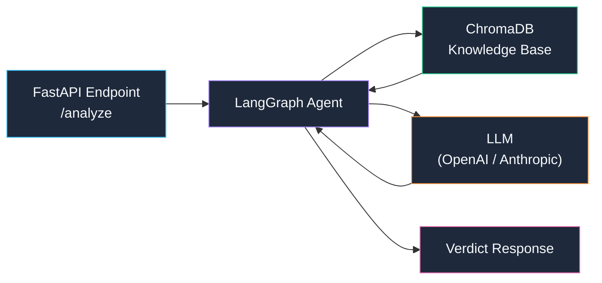
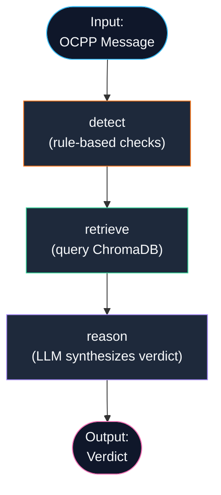

# OCPP Sentinel — Phased Implementation Plan

An AI security triage copilot that analyzes OCPP 1.6-J messages against five known attack patterns (STRIDE-based) and returns verdicts grounded in a knowledge base.

## Architecture Overview



## The Five Attack Scenarios (STRIDE-Mapped)

These are grounded in published OCPP security research — NOT invented:

| # | STRIDE Category | OCPP Attack | Detection Signal |
|---|----------------|-------------|-----------------|
| 1 | **Spoofing** | `RemoteStartTransaction` with no valid/matching authorization | `idTag` not in authorized list, no prior `Authorize.conf` |
| 2 | **Tampering** | `MeterValues` reporting implausibly low energy for session duration | Energy ÷ duration < threshold (e.g. < 0.5 kWh/hr for a "charging" session) |
| 3 | **Repudiation** | Replayed `Authorize` message reused to start a second free session | Duplicate `idTag` + `messageId` seen within a time window |
| 4 | **Info Disclosure** | `idTag`/session token appearing in plaintext in logs or diagnostic fields | Token patterns found in `vendorId`, `data`, or `info` fields |
| 5 | **DoS** | Abnormal burst of `StatusNotification` messages | > N messages from same `chargePointId` in < T seconds |

---

## Phase 1 — Project Structure & Sample Data

> **What you'll learn:** Python project layout, `pyproject.toml`, type hints, Pydantic models, OCPP 1.6-J message shapes.

### What we build
- Project scaffolding (`src/ocpp_sentinel/`)
- Pydantic models for the 7 key OCPP 1.6-J message types
- A `data/` folder with sample JSON messages — 5 benign + 5 malicious (one per attack type)
- A simple test script that loads and validates each message

### Files created
- `pyproject.toml` — project metadata & dependencies
- `src/ocpp_sentinel/__init__.py`
- `src/ocpp_sentinel/models/ocpp_messages.py` — Pydantic models
- `data/samples/` — 10 JSON sample messages
- `tests/test_models.py` — validates samples parse correctly

### How to test
```bash
pip install -e ".[dev]"
pytest tests/test_models.py -v
```

---

## Phase 2 — Knowledge Base (ChromaDB)

> **What you'll learn:** What embeddings are, how a vector store works, how RAG grounds LLM answers in facts.

### What we build
- Written explanations for each of the 5 attack types (2-3 paragraphs each)
- Relevant OCPP 1.6-J spec excerpts for each attack (e.g., Section 5.16 for `RemoteStartTransaction`)
- A loader script that chunks these documents and indexes them into ChromaDB
- A query test to confirm retrieval works

### Files created
- `data/knowledge_base/` — 5 attack descriptions + spec excerpts as Markdown files
- `src/ocpp_sentinel/knowledge/loader.py` — indexes documents into ChromaDB
- `src/ocpp_sentinel/knowledge/retriever.py` — queries the vector store
- `tests/test_knowledge.py`

### How to test
```bash
python -m ocpp_sentinel.knowledge.loader   # indexes the docs
pytest tests/test_knowledge.py -v           # queries and checks results
```

---

## Phase 3 — Rule-Based Detectors

> **What you'll learn:** Pattern matching in Python, the strategy pattern, how to separate detection logic from the agent.

### What we build
- Five detector functions (one per attack), each taking an OCPP message and returning a detection result
- A `DetectionResult` model: `detected: bool`, `attack_type: str`, `confidence: float`, `details: str`
- A dispatcher that routes each message type to the right detector(s)

### Files created
- `src/ocpp_sentinel/detectors/base.py` — base interface
- `src/ocpp_sentinel/detectors/spoofing.py`
- `src/ocpp_sentinel/detectors/tampering.py`
- `src/ocpp_sentinel/detectors/repudiation.py`
- `src/ocpp_sentinel/detectors/info_disclosure.py`
- `src/ocpp_sentinel/detectors/dos.py`
- `src/ocpp_sentinel/detectors/dispatcher.py`
- `tests/test_detectors.py`

### How to test
```bash
pytest tests/test_detectors.py -v
```

---

## Phase 4 — LangGraph Agent

> **What you'll learn:** What an AI agent is, how LangGraph defines state machines, how to combine rule-based checks with LLM reasoning.

### What we build
- A LangGraph state graph with three nodes:
  1. **`detect`** — runs the rule-based detectors from Phase 3
  2. **`retrieve`** — queries ChromaDB for relevant attack knowledge
  3. **`reason`** — sends the detection results + retrieved knowledge to the LLM, which produces the final verdict
- The agent returns a structured `Verdict`: `status` (normal/suspicious), `attack_category`, `reason`, `source_reference`



### Files created
- `src/ocpp_sentinel/agent/state.py` — agent state schema
- `src/ocpp_sentinel/agent/nodes.py` — detect, retrieve, reason nodes
- `src/ocpp_sentinel/agent/graph.py` — LangGraph graph definition
- `tests/test_agent.py`

### How to test
```bash
# Requires an LLM API key (OPENAI_API_KEY or ANTHROPIC_API_KEY)
pytest tests/test_agent.py -v
```

---

## Phase 5 — FastAPI Server

> **What you'll learn:** How to build REST APIs with FastAPI, request/response models, dependency injection, error handling.

### What we build
- A `POST /analyze` endpoint that accepts an OCPP message and returns a verdict
- A `GET /health` endpoint
- Input validation using the Pydantic models from Phase 1
- Proper error responses

### Files created
- `src/ocpp_sentinel/api/app.py` — FastAPI application
- `src/ocpp_sentinel/api/routes.py` — endpoint definitions
- `src/ocpp_sentinel/api/schemas.py` — request/response schemas
- `tests/test_api.py`

### How to test
```bash
uvicorn ocpp_sentinel.api.app:app --reload
# Then in another terminal:
curl -X POST http://localhost:8000/analyze \
  -H "Content-Type: application/json" \
  -d @data/samples/malicious_spoofing.json
```

---

## Phase 6 — Structured Logging & Audit Trail

> **What you'll learn:** Python's `logging` module, structured JSON logs, why audit trails matter for security tools.

### What we build
- Structured JSON logging for every analysis request
- An audit log that records: timestamp, message type, verdict, attack category, processing time
- Log rotation configuration

### Files created
- `src/ocpp_sentinel/logging_config.py`
- Updates to `api/app.py` to add logging middleware

### How to test
```bash
# Run the API, send a request, check the log file:
cat logs/audit.jsonl | python -m json.tool
```

---

## Phase 7 — Docker

> **What you'll learn:** Dockerfiles, multi-stage builds, `docker-compose`, environment variable management.

### What we build
- A `Dockerfile` with a multi-stage build (small final image)
- A `docker-compose.yml` for easy local development
- `.env.example` for API key configuration

### Files created
- `Dockerfile`
- `docker-compose.yml`
- `.env.example`
- `.dockerignore`

### How to test
```bash
docker compose up --build
# Then test the /analyze endpoint as before
```

---

## Phase 8 — Demo UI

> **What you'll learn:** How to build a simple frontend that talks to your API, basic HTML/CSS/JS.

### What we build
- A single-page web UI where you can paste an OCPP JSON message and see the verdict
- Pre-loaded example messages (one per attack type) as quick-select buttons
- A results panel showing verdict, attack type, explanation, and source reference
- Served as static files from FastAPI

### Files created
- `src/ocpp_sentinel/static/index.html`
- `src/ocpp_sentinel/static/styles.css`
- `src/ocpp_sentinel/static/app.js`

### How to test
```bash
# With the API running:
open http://localhost:8000
```

---

## Phase 9 — README & Documentation

> **What you'll learn:** How to write a good open-source README, document architecture decisions, and present a portfolio project.

### What we build
- A comprehensive `README.md` with:
  - Project overview and architecture diagram
  - Setup instructions
  - API documentation
  - Attack categories table (noting they're based on published OCPP/STRIDE research — you'll add citations)
  - Screenshots of the demo UI
  - What you learned / next steps

---

## Dependency Summary

| Package | Purpose | Phase |
|---------|---------|-------|
| `pydantic` | Data validation & OCPP message models | 1 |
| `chromadb` | Vector store for knowledge base | 2 |
| `langchain` | Document loading, text splitting, embeddings | 2 |
| `langgraph` | Agent state machine orchestration | 4 |
| `langchain-openai` or `langchain-anthropic` | LLM integration | 4 |
| `fastapi` | REST API framework | 5 |
| `uvicorn` | ASGI server | 5 |
| `pytest` | Testing | 1–8 |
| `httpx` | Async HTTP client for API tests | 5 |

---

## Open Questions

> [!IMPORTANT]
> Please answer these before I start coding:

1. **LLM Provider** — Do you want to use **OpenAI** (`gpt-4o-mini` is cheapest) or **Anthropic** (`claude-3-haiku` is cheapest)? I'll set up whichever you prefer. You can always swap later.

2. **Python environment** — Are you using `venv`, `conda`, or something else? I'll tailor the setup instructions.

3. **Phase order** — The plan above goes Data → KB → Detectors → Agent → API → Logging → Docker → UI → README. Want to change the order or skip anything?

4. **Knowledge base content** — You mentioned you'll help write the attack descriptions. Want me to draft initial versions that you then review/edit, or do you want to write them from scratch?
